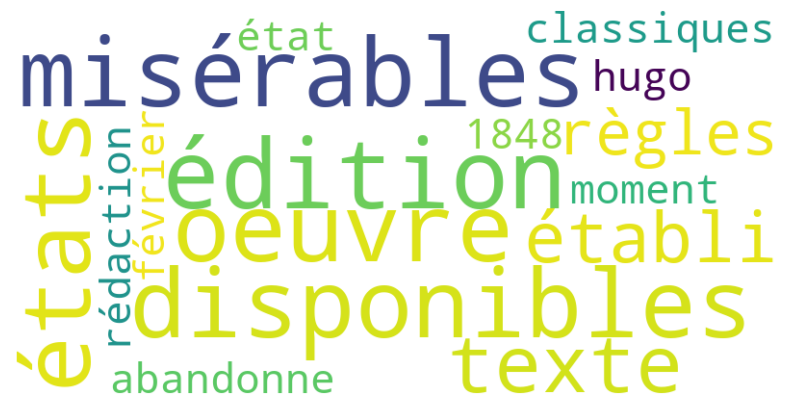
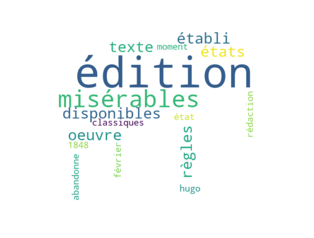

# NLP Partie 3 - WordCloud

## Introduction

Un WordCloud, ou nuage de mots, est une représentation visuelle permettant d’identifier rapidement les mots les plus fréquents dans un texte. La taille des mots est proportionnelle à leur occurrence. Cette méthode est particulièrement utile pour visualiser des tendances dans des textes longs ou complexes. Elle repose sur des étapes préliminaires de prétraitement, telles que la suppression des stopwords et le lemmatising.

## Objectif

Apprendre à générer un WordCloud en Python en passant par toutes les étapes de prétraitement des données textuelles. 

## Prérequis

- Nettoyage du texte : suppression des stopwords, ponctuations, mise en forme.
- Compréhension des concepts de stemming et lemmatising (voir fiches précédentes).

## Librairies utilisées

```python
# Installation des bibliothèques requises si besoin
# pip install wordcloud nltk matplotlib spacy pillow

import nltk
from nltk.corpus import stopwords
nltk.download('stopwords')
import spacy
import string
from wordcloud import WordCloud
import matplotlib.pyplot as plt
import numpy as np
from PIL import Image
```

## Étapes de création

### 1. Nettoyage du texte

Nettoyer le texte pour supprimer la ponctuation, les stopwords et normaliser les mots en utilisant le lemmatising.

- S'assurer au préalable de télécharger le dictionnaire français de spacy load
```python
python -m spacy download fr_core_news_sm
```

- Fonction de nettoyage de texte
```python
nlp = spacy.load('fr_core_news_sm')
stop_words = nlp.Defaults.stop_words

def nettoyer_texte(texte):
    doc = nlp(texte)
    tokens_clean = [
        token.text.lower()
        for token in doc
        if token.text.lower() not in stop_words and token.text not in string.punctuation
    ]
    return tokens_clean

texte = '''Cette édition des Misérables rend disponibles trois états de l'oeuvre: son texte, établi selon les règles classiques, son état au moment où Hugo en abandonne la rédaction en février 1848."'''
mots_nettoyes = nettoyer_texte(texte)
print(mots_nettoyes)
```

### 2. Calcul des fréquences des mots

Créer un dictionnaire contenant la fréquence d’apparition de chaque mot.

```python
def frequences_mots(liste_mots):
    freq_dist = nltk.FreqDist(liste_mots)
    return dict(freq_dist)

frequences = frequences_mots(mots_nettoyes)
print(frequences)
```

### 3. Génération d’un WordCloud

Générer un WordCloud à partir des fréquences calculées.

```python
wordcloud = WordCloud(width=800, height=400, max_font_size=100, background_color="white")
wordcloud.generate_from_frequencies(frequences)

plt.figure(figsize=(10, 5))
plt.imshow(wordcloud, interpolation="bilinear")
plt.axis("off")
plt.show()
```



### 4. Personnalisation

Changer le fond, les couleurs ou utiliser un masque pour donner une forme au WordCloud.

#### Exemple avec un masque en forme de carte

```python
# Charger une image pour le masque
mask_image = np.array(Image.open("Éléphant_(détouré).png")) # Exemple d'image à fond blanc (avoir un contour précis)

wordcloud = WordCloud(width=800, height=400, max_font_size=100, background_color="white", mask=mask_image)
wordcloud.generate_from_frequencies(frequences)

plt.figure(figsize=(10, 5))
plt.imshow(wordcloud, interpolation="bilinear")
plt.axis("off")
plt.show()
```


## Ressources supplémentaires

- [Documentation officielle de WordCloud](https://amueller.github.io/word_cloud/)
- [Python Graph Gallery : WordCloud basique](https://python-graph-gallery.com/260-basic-wordcloud/)
- [Personnalisation avancée de WordCloud](https://python-graph-gallery.com/261-custom-python-wordcloud/)
